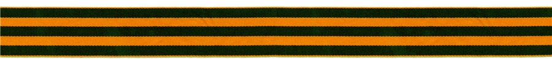
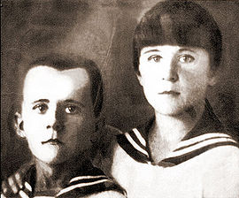
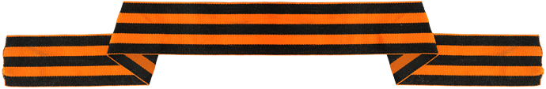
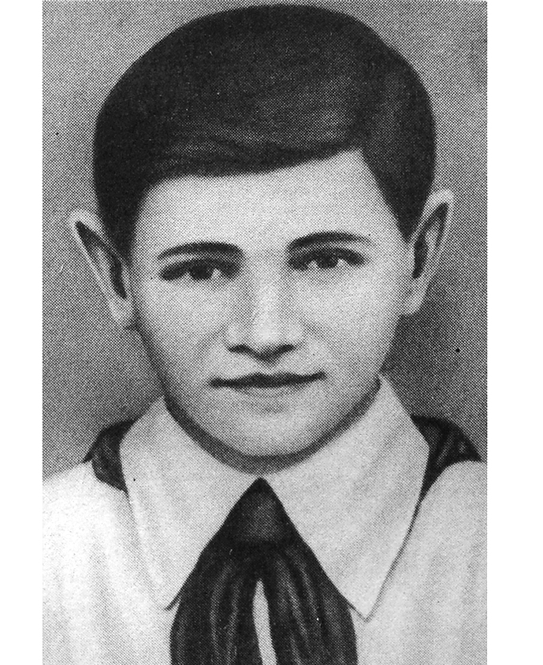
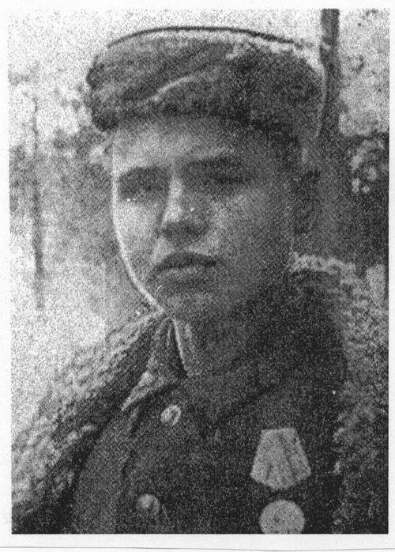
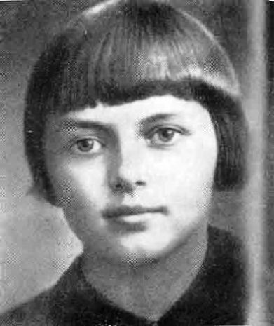

<html>
<head><title>Дети-герои</title></head>
<body>
<b>Morituri te salutant</b><body>
<h1 align="center" title="Краткая справка о героях войны.">Герои Великой отечественной войны.</h1> 

<a href="#nerva">1.Марат Казей, 14 лет</a> 
<a href="#train">2.Валя Котик, 14 лет</a> 
<a href="#adrian">3.Леня Голиков, 16 лет</a> 
<a href="#anton">4.Саша Чекалин, 16 лет</a> 
<a href="#mark"> 5.Зина Портнова, 17 лет</a> 

<b><i>Всем миром, всем народом, всей землёй поклонимся за тот священный бой!
</b></i>

<h2>5 юных героев Великой отечественной войны<h2> 

<a name="nerva"><h3 title="Участник партизанского отряда имени 25-летия Октября, разведчик штаба 200-й партизанской бригады имени Рокоссовского на оккупированной территории Белорусской ССР."><i>Марат Казей, 14 лет</i></h3> 

 
 

Марат родился в 1929 году в деревне Станьково Минской области Белоруссии, успел окончить 4 класса сельской школы. До войны его родители были арестованы по обвинению во вредительстве и "троцкизме", многочисленных детей "разбросали" по бабушкам-дедушкам. Но семья Казеев не обозлилась на советскую власть: В 1941 году, когда Белоруссия стала оккупированной территорией, Анна Казей, жена "врага народа" и мать маленьких Марата и Ариадны, прятала у себя раненых партизан, за что была казнена немцами. А брат с сестрой ушли в партизаны. Ариадну впоследствии эвакуировали, но Марат остался в отряде.

Наравне со старшими товарищами он ходил в разведку - как в одиночку, так и с группой. Участвовал в рейдах. Подрывал эшелоны. За бой в январе 1943 года, когда, раненый, он поднял своих товарищей в атаку и пробился сквозь вражеское кольцо, Марат получил медаль "За отвагу".

А в мае 1944-го при выполнении очередного задания около деревни Хоромицкие Минской области 14-летний боец погиб. Возвращаясь с задания вдвоем с командиром разведки, они наткнулись на немцев. Командира убили сразу, а Марат, отстреливаясь, залег в ложбинке. Уходить в чистом поле было некуда, да и возможности не было - подросток был тяжело ранен в руку. Пока были патроны, держал оборону, а когда магазин опустел, взял последнее оружие - две гранаты, с пояса. Одну бросил в немцев сразу, а со второй подождал: когда враги подошли совсем близко, взорвал себя вместе с ними.

В 1965 году Марату Казею присвоено звание Героя СССР.</a>

<

<a name="train"><h3 title="Партизан-разведчик в отряде имени Кармелюка, самый юный Герой СССР."><i>Валя Котик, 14 лет</i></h3> 

 
 

Валя родился в 1930 году в селе Хмелевка Шепетовского района Каменец-Подольской области Украины. До войны окончил пять классов. В занятом немецкими войсками селе мальчишка тайком собирал оружие, боеприпасы и передавал их партизанам. И вел собственную маленькую войну, как ее понимал: рисовал и расклеивал на видных местах карикатуры на гитлеровцев.

С 1942 года он связался с Шепетовской подпольной партийной организацией и выполнял ее поручения по разведке. А осенью того же года Валя со своими сверстниками-мальчишками получили первое настоящее боевое задание: ликвидировать начальника полевой жандармерии.

"Рев моторов становился громче - машины приближались. Уже хорошо были видны лица солдат. Со лбов, полузакрытых зелеными касками, стекал пот. Некоторые солдаты беспечно сняли каски. Передняя машина поравнялась с кустами, за которыми спрятались мальчики. Валя привстал, отсчитывая про себя секунды. Машина проехала, против него уже броневик. Тогда он поднялся во весь рост и с криком "Огонь!" одну за другой швырнул две гранаты... Одновременно прозвучали взрывы слева и справа. Обе машины остановились, передняя загорелась. Солдаты стремительно спрыгивали на землю, бросались в кювет и оттуда открывали беспорядочный огонь из автоматов", - так описывает этот первый бой советский учебник. Задание партизан Валя тогда выполнил: начальник жандармерии, обер-лейтенант Франц Кениг и семеро немецких солдат погибли. Порядка 30 человек были ранены.

В октябре 1943 года юный боец разведал место нахождения подземного телефонного кабеля гитлеровской ставки, который вскоре был подорван. Валя также участвовал в уничтожении шести железнодорожных эшелонов, склада.

29 октября 1943 года, будучи на посту, Валя заметил, что каратели устроили облаву на отряд. Убив из пистолета фашистского офицера, подросток поднял тревогу, и партизаны успели приготовиться к бою. 16 февраля 1944 года, через 5 пять дней после своего 14-летия, в бою за город Изяслав Каменец-Подольской ныне Хмельницкой области разведчик был смертельно ранен и на следующий день скончался.

В 1958 году Валентину Котику присвоено звание Героя Советского Союза.</a>

<a name="adrian"><h3 title="Разведчик 67-го отряда 4-й Ленинградской партизанской бригады.."><i>Леня Голиков, 16 лет</i></h3> 

 
 

Разведчик 67-го отряда 4-й Ленинградской партизанской бригады.

Родился в 1926 году в деревне Лукино Парфинского района Новгородской области. Когда началась война, он добыл винтовку и ушел в партизаны. Худенький, небольшого роста, он выглядел еще младше всех 14-ти лет. Под видом нищего Леня ходил по деревням, собирая необходимые данные о расположении фашистских войск и о количестве их боевой техники, а потом передавал эти сведения партизанам.

В 1942 году он вступил в отряд. "Участвовал в 27 боевых операциях, истребил 78 немецких солдат и офицеров, взорвал 2 железнодорожных и 12 шоссейных мостов, подорвал 9 автомашин с боеприпасами... 12 августа в новом районе боевых действий бригады Голиков разбил легковую автомашину, в которой находился генерал-майор инженерных войск Ричард Виртц, направляющийся из Пскова на Лугу", - такие данные содержатся в его наградном листке.

В</a>

<a name="anton"><h3 title="Член партизанского отряда Передовой Тульской области."><i>Саша Чекалин, 16 лет</i><h3> 

 
 

Родился в 1925 году в селе Песковатское, ныне Суворовского района Тульской области. До начала войны окончил 8 классов. После оккупации родного села немецко-фашистскими войсками в октябре 1941 года вступил в истребительный партизанский отряд "Передовой", где успел прослужить всего чуть больше месяца.

К ноябрю 1941 года партизанский отряд нанес фашистам значительный урон: горели склады, взрывались на минах автомашины, шли под откос вражеские поезда, бесследно исчезали часовые и патрули. Однажды группа партизан, в числе которых был и Саша Чекалин, устроили засаду у дороги на город Лихвин (Тульская область). Вдали показалась автомашина. Прошла минута - и взрыв разнес машину на части. За ней прошли и взорвались еще несколько машин. Одна из них, переполненная солдатами, пыталась проскочить. Но граната, брошенная Сашей Чекалиным, уничтожила и ее.

В начале ноября 1941 года Саша простудился и слег. Комиссар разрешил ему отлежаться у проверенного человека в ближайшей деревне. Но нашелся предатель, который выдал его. Ночью фашисты ворвались в дом, где лежал больной партизан. Чекалин успел схватить приготовленную гранату и бросить ее, но та не взорвалась... Через несколько дней пыток фашисты повесили подростка на центральной площади Лихвина и более 20 дней не разрешали убирать с виселицы его труп. И только когда город был освобожден от захватчиков, боевые соратники партизана Чекалина похоронили его с воинскими почестями.

Звание Героя Советского Союза Александру Чекалину было присвоено в 1942 году.

</a>.

<a name="mark"><h3 title="Член подпольной комсомсомольско-молодежной организации "Юные мстители", разведчица партизанского отряда имени Ворошилова на территории Белорусской ССР."><i>Зина Портнова, 17 лет</i><h3> 

 
 

 Родилась в 1926 году в Ленинграде, окончила там 7 классов и на летние каникулы поехала отдыхать к родственникам в деревню Зуя Витебской области Белоруссии. Там ее и застала война.

В 1942 году она вступила в Обольскую подпольную комсомольско-молодежную организацию "Юные мстители" и активно участвовала в распространении листовок среди населения и диверсиях против захватчиков.

С августа 1943 года Зина - разведчица партизанского отряда имени Ворошилова. В декабре 1943-го она получила задание выявить причины провала организации "Юные мстители" и наладить связь с подпольем. Но при возвращении в отряд Зину арестовали.

Во время допроса девочка схватила со стола пистолет фашистского следователя, застрелила его и еще двух гитлеровцев, пыталась бежать, но была схвачена.

Из книги "Зина Портнова" советского писателя Василия Смирнова: "Допрашивали ее самые изощренные в жестоких пытках палачи…. Ей обещали сохранить жизнь, если только юная партизанка во всем признается, назовет имена всех известных ей подпольщиков и партизан. И опять гестаповцы встречались с удивлявшей их непоколебимой твердостью этой упрямой девочки, которая в их протоколах именовалась "советской бандиткой". Зина, измученная пытками, отказывалась отвечать на вопросы, надеясь, что так ее быстрее убьют.… Однажды на тюремном дворе заключенные видели, как совсем седая девочка, когда ее вели на очередной допрос-пытку, бросилась под колеса проезжавшего грузовика. Но машину остановили, девчонку вытащили из-под колес и снова повели на допрос…".

10 января 1944 года в деревне Горяны ныне Шумилинского района Витебской области Белоруссии 17-летнюю Зину расстреляли.

Звание Героя Советского Союза Портновой Зинаиде было присвоено в 1958 году.</a>

</body>
</html>
